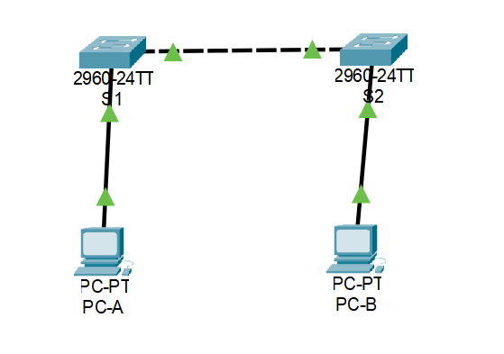

# Praktikum [2]: [Jaringan Komputer]

## 📄 Deskripsi
(Repositori ini dibuat sebagai tempat pengumpulan tugas akhir praktikum jaringan komputer judul 1: Basic switch and end device configuration")

---

## 📁 File & Link

* **File Packet Tracer:** `(./PJKTA1.pkt)`
* **Link Youtube:**  `https://youtu.be/w2TpuODPLUA `

---

## 📸 Screenshot Hasil

Berikut adalah beberapa screenshot dari hasil pengerjaan praktikum:

**1. Topologi Jaringan**

