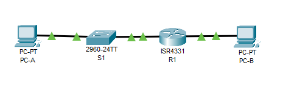
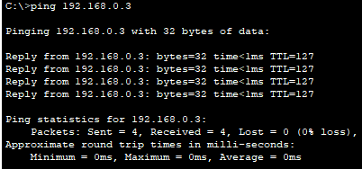
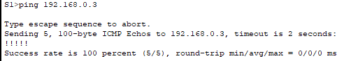
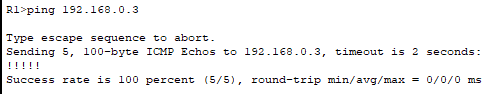

# Praktikum [2]: [Jaringan Komputer]

## 📄 Deskripsi
(Repositori ini dibuat sebagai tempat pengumpulan tugas akhir praktikum jaringan komputer judul 2: Build a Switch and Router Network")

---

## 📁 File & Link

* **File Packet Tracer:** `(./PJKTA2.pkt)`
* **Link Youtube:**  `https://youtu.be/Xbw8cGdQ-w4 `

---

## 📸 Screenshot Hasil

Berikut adalah beberapa screenshot dari hasil pengerjaan praktikum:

**1. Topologi Jaringan**

**2. Screenshot ping**
[Ping PC-B ke PC-A](./1.png)

